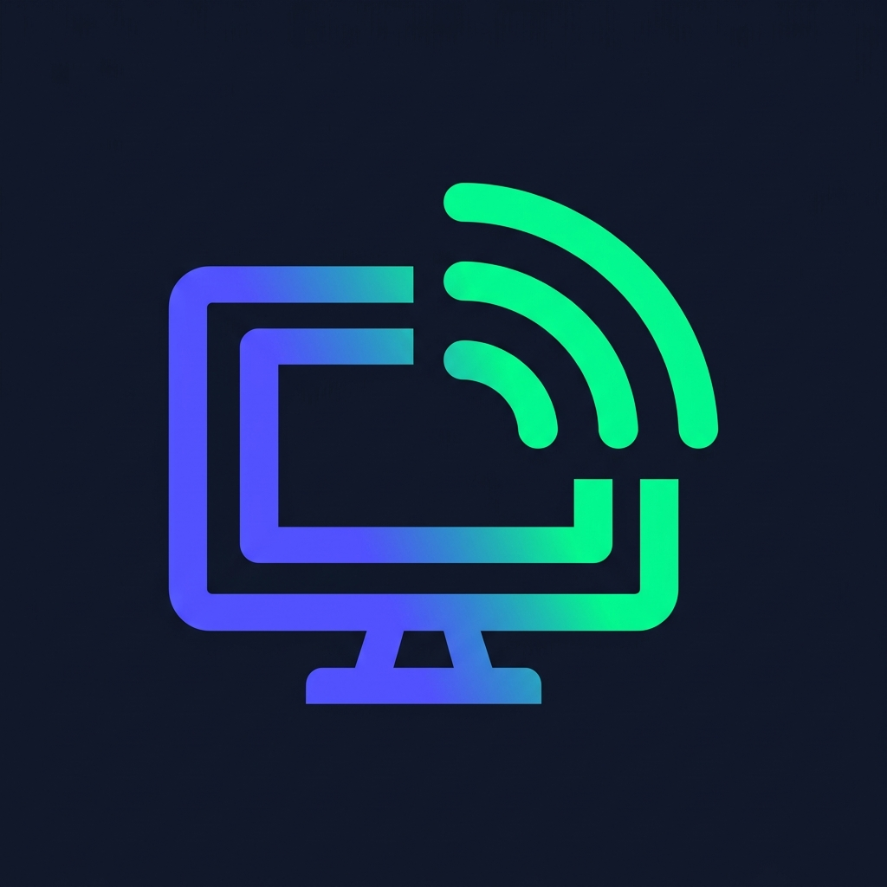
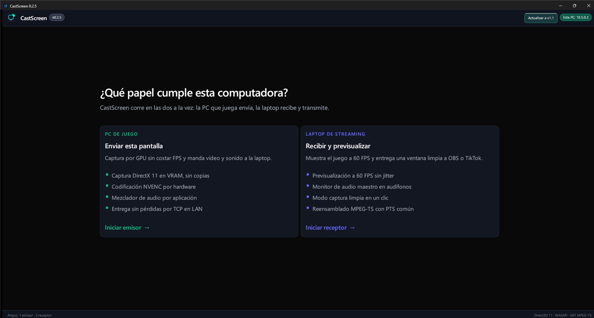
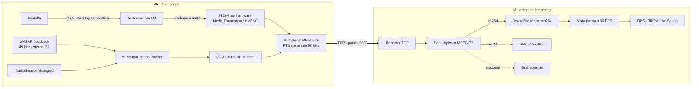
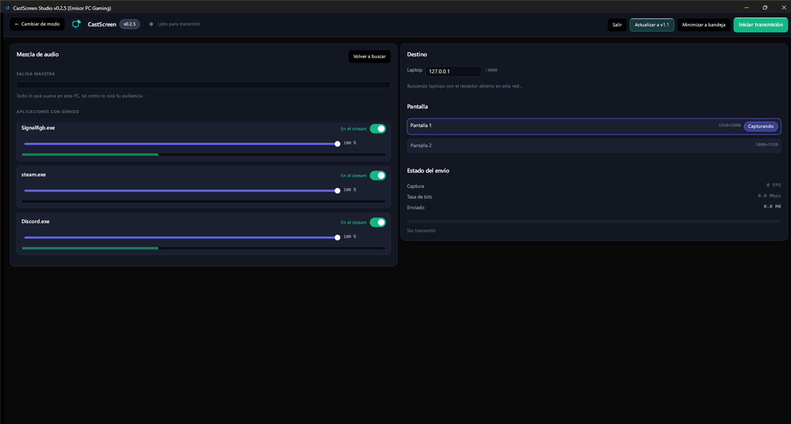
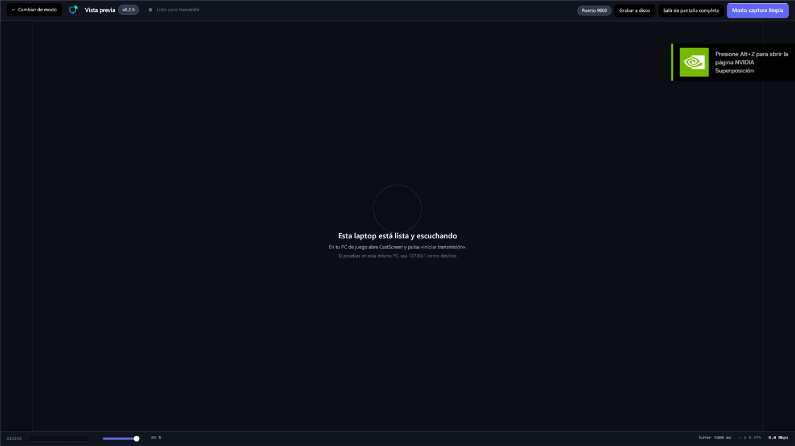

<div align="center">



# CastScreen

**Juega en una PC. Transmite desde la otra. Sin perder un solo FPS.**

Streaming de doble PC por red local, con audio y vídeo sincronizados por reloj común
y un mezclador que decide, aplicación por aplicación, qué entra al directo.

[](LICENSE)
[](https://www.rust-lang.org/)
[](#requisitos)
[](https://github.com/gabjesus15/CastScreen/releases)



</div>

---

## El problema

Transmitir desde dos PCs debería ser sencillo, y con las herramientas habituales no lo es:

| | OBS Teleport | NDI | VoiceMeeter + RTMP | **CastScreen** |
|:---|:---:|:---:|:---:|:---:|
| Sincronía A/V | Se desfasa | Se desajusta en Wi-Fi | 1–3 s de latencia | **PTS común de 90 kHz** |
| Integridad en Wi-Fi | Sin recuperación | Pierde paquetes | Inestable | **TCP: sin pérdidas ni tearing** |
| Coste en la PC de juego | Alto (OBS abierto) | Medio-alto | Alto (cables virtuales) | **Captura en VRAM, sin copias** |
| Mezcla por aplicación | No | No | Complejo y frágil | **Nativa (`IAudioSessionManager2`)** |
| Previsualización antes del directo | No | Sólo en Studio Monitor | No | **Ventana a 60 FPS con medidores** |

---

## Cómo funciona



El detalle que lo hace funcionar: **un solo `QueryPerformanceCounter`** genera la marca de tiempo del vídeo y la del audio. Los dos flujos viajan en el mismo contenedor MPEG-TS con el mismo PTS, así que no pueden separarse por el camino.

---

## Qué hace

### Captura sin coste

`IDXGIOutputDuplication` entrega la imagen del escritorio como una textura que **ya está en la VRAM**. De ahí pasa directa al codificador por hardware. La imagen nunca baja a la RAM del sistema, así que el juego no nota que hay una captura en marcha.

### Mezcla por aplicación

Cada programa que suena aparece con su propio interruptor y su propio fader. Deja Discord fuera del directo sin dejar de escucharlo, o baja Spotify sin tocar el juego. Sin cables virtuales, sin VoiceMeeter: son las APIs de sesiones de audio de Windows.

<div align="center">

</div>

### Ver antes de emitir

El receptor decodifica y muestra el flujo a 60 FPS con medidores estéreo. **Modo captura limpia** oculta toda la interfaz de un clic y deja sólo la imagen, que es exactamente lo que OBS o TikTok Live Studio capturan como ventana.

<div align="center">

</div>

### Cambiar de papel sin cerrar nada

Las dos ventanas tienen **← Cambiar de modo** arriba a la izquierda. Vuelve al selector; si hay algo en vivo, pregunta primero.

### Grabar en crudo

El receptor puede volcar el flujo MPEG-TS tal cual a un `.ts`, sin recodificar y sin coste de CPU. Listo para Premiere, CapCut o VLC.

### Actualizarse solo

Cuando se publica una versión nueva en GitHub, la aplicación la detecta, la descarga y lanza el instalador. Sin abrir el navegador.

---

## Instalación

### Con el instalador (recomendado)

1. Descarga `CastScreen_Setup.exe` desde **[Releases](https://github.com/gabjesus15/CastScreen/releases)**.
2. Instálalo **en las dos computadoras**.
3. Abre `CastScreen` en cada una y elige su papel.

Instala en `C:\Program Files\CastScreen`, crea accesos directos y se desinstala desde el Panel de control como cualquier programa.

### Desde el código

```bash
git clone https://github.com/gabjesus15/CastScreen
cd CastScreen
cargo run -p castscreen-launcher --release
```

---

## Uso

### Los dos papeles

| | PC de juego | Laptop de streaming |
|---|---|---|
| **Qué hace** | Captura y envía | Recibe, muestra y entrega |
| **Tarjeta** | Enviar esta pantalla | Recibir y previsualizar |
| **Atajo** | <kbd>1</kbd> | <kbd>2</kbd> |

La tarjeta entera es el botón: puedes pulsar en cualquier parte de ella.

### La primera vez

1. **En la laptop**, elige *Recibir y previsualizar*. Se abre a pantalla completa y queda escuchando en el puerto 9000.
2. **En la PC de juego**, elige *Enviar esta pantalla*.
3. En **Destino**, la laptop aparece sola en la lista (descubrimiento por UDP en el puerto 9001). Pulsa *Usar esta*, o escribe su IP a mano.
4. Elige la pantalla a capturar y pulsa **Iniciar transmisión**.
5. **En la laptop**, pulsa **Modo captura limpia**. Queda sólo la imagen; se sale con <kbd>Esc</kbd>.
6. En OBS o TikTok Live Studio, añade una **Captura de ventana** apuntando a la ventana de CastScreen.

> **Probar en una sola PC:** pon `127.0.0.1` como destino y abre los dos modos en la misma máquina.

Guías largas: **[OBS Studio](docs/OBS_SETUP.md)** · **[TikTok Live Studio](docs/TIKTOK_SETUP.md)**

---

## Interfaz

La interfaz está construida sobre un sistema de diseño propio, escrito siguiendo las reglas de diseño de Apple —interfaces fluidas, tipografía de UI y principios de diseño— traducidas a `egui`. Vive en [`crates/castscreen-core/src/theme/`](crates/castscreen-core/src/theme/).

| Módulo | De qué se ocupa |
|---|---|
| `motion.rs` | Springs con damping y response; nada de duraciones fijas |
| `typography.rs` | Ocho roles, cada uno con su propio tracking e interlineado |
| `material.rs` | Cuatro capas de material, profundidad, espaciado, scrims |
| `controls.rs` | Botones, interruptores, faders, tarjetas, hojas modales |
| `meters.rs` | Medidores con retención de pico, indicadores, insignia de emisión |

Las reglas que lo gobiernan:

- **Ninguna animación tiene duración fija.** Todo es un spring que arranca del valor que ya está en pantalla, así que se puede interrumpir y revertir a mitad sin dar un salto.
- **El feedback vive en la pulsación, no en el clic.** Un control se hunde al bajar el puntero; la acción se ejecuta al soltarlo encima, y se cancela arrastrando fuera.
- **Una sola acción primaria por región,** y **una sola confirmación en toda la aplicación**: cortar algo que está en vivo. Si todo preguntara, nadie leería ninguna.
- **El tracking depende del tamaño.** Negativo en los titulares, cero en el cuerpo, muy abierto en las mayúsculas pequeñas.
- **Se respeta el ajuste de Windows de efectos de animación.** Con él apagado, los springs se resuelven al instante y el movimiento ambiental se detiene.

Hay tests que fallan si alguien rompe una de estas reglas: que el spring crítico no rebote, que interrumpir una animación no salte, que el tracking se abra al bajar de tamaño, que un pico de audio se muestre al instante.

---

## Especificaciones

| | |
|---|---|
| **Vídeo** | H.264, 1920×1080 a 60 FPS, 18 Mbps, keyframe cada segundo |
| **Codificador** | Media Foundation Transform por hardware (NVENC en NVIDIA) |
| **Decodificador** | openh264 (Cisco), compilado con el proyecto |
| **Audio** | 48 kHz estéreo; captura f32, transporte PCM i16 LE sin pérdida |
| **Contenedor** | MPEG-TS con PTS común de 90 kHz |
| **Transporte** | TCP, puerto 9000 · descubrimiento UDP, puerto 9001 |
| **Interfaz** | `eframe` / `egui` 0.28 |

---

## Estructura

```
CastScreen/
├── crates/
│   ├── castscreen-core/       Reloj QPC, mezcla PCM, sistema de diseño, actualizador
│   │   └── src/theme/         motion · typography · material · controls · meters
│   ├── castscreen-capture/    DXGI Desktop Duplication y sesiones WASAPI
│   ├── castscreen-encoder/    H.264 por hardware y empaquetado PCM
│   ├── castscreen-network/    Multiplexor MPEG-TS, transporte TCP, descubrimiento LAN
│   ├── castscreen-sender/     Ventana del emisor
│   ├── castscreen-receiver/   Ventana del receptor
│   └── castscreen-launcher/   Selector de modo (CastScreen.exe)
├── docs/                      Arquitectura y guías de OBS y TikTok
├── installer/                 Script de Inno Setup
└── AGENTS.md                  Contexto para asistentes de IA
```

---

## Desarrollo

```bash
cargo build --workspace --release    # compilar todo
cargo test --workspace               # 29 tests
cargo run -p castscreen-sender       # sólo el emisor
cargo run -p castscreen-receiver     # sólo el receptor
```

Reglas del código, en corto:

1. Cero asignaciones dinámicas en el bucle de fotogramas.
2. Comunicación entre hilos por canales `crossbeam-channel`; ningún hilo de proceso espera a la interfaz.
3. `thiserror` en las bibliotecas, `anyhow` sólo en los binarios.
4. El reloj de audio nunca se pausa ni se reinicia, pase lo que pase con el vídeo.

Detalle completo en **[docs/ARCHITECTURE.md](docs/ARCHITECTURE.md)** y **[AGENTS.md](AGENTS.md)**.

---

## Requisitos

- **Windows 10 o 11** en las dos computadoras.
- **PC de juego:** GPU con codificador H.264 por hardware (NVENC en NVIDIA; Media Foundation también expone los de AMD e Intel).
- **Red local:** Ethernet o Wi-Fi 5/6. Las dos máquinas en la misma subred.
- **Laptop:** cualquiera capaz de decodificar 1080p60 por software.

---

## Estado

CastScreen está en uso y en desarrollo activo. Lo que todavía no está:

- El transporte es **TCP**, no SRT. TCP entrega sin pérdidas ni desorden en una LAN, que es lo que necesita una vista previa, pero no permite ingesta directa por `srt://` en OBS: el camino soportado es capturar la ventana del receptor.
- El audio viaja como **PCM sin comprimir**. Es perfecto en calidad y trivial de decodificar, pero ocupa más banda que AAC.
- Sin soporte de macOS ni Linux: la captura depende de APIs de Windows.

---

## Licencia

MIT. Ver **[LICENSE](LICENSE)**.

<div align="center">
<sub>Hecho para streamers que juegan en una PC y emiten desde otra.</sub>
</div>
