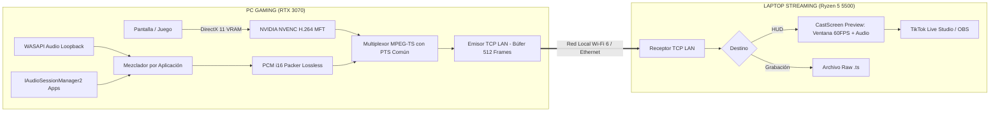

# 📡 CastScreen

> **Solución de streaming de doble PC ultraligera por red local (LAN), con sincronización matemática perfecta de audio y video, mezclador de aplicaciones integrado y cero impacto en FPS de juego.**

[](https://opensource.org/licenses/MIT)
[](https://www.rust-lang.org/)
[](https://developer.nvidia.com/nvidia-video-codec-sdk)
[](https://www.srtalliance.org/)

---

## 🎯 ¿Por qué existe CastScreen?

Transmitir videojuegos desde una PC de juegos a una laptop de streaming por red local suele ser una experiencia frustrante con las herramientas existentes:

| Característica | OBS Teleport | NDI Scan Converter | VoiceMeeter + RTMP | 📡 **CastScreen** |
| :--- | :---: | :---: | :---: | :---: |
| **Sincronización Audio/Video** | ❌ Desfase y crujidos | ⚠️ Se desajusta en Wi-Fi | ❌ Latencia alta (1-3s) | ✅ **Perfecta (PTS Común 90kHz)** |
| **Resiliencia en Wi-Fi 6** | ❌ Sin búfer adaptativo | ❌ Pérdida de paquetes | ⚠️ Inestable | ✅ **Búfer ARQ (500–2000ms)** |
| **Consumo en PC Gaming** | ❌ Alto (OBS abierto) | ⚠️ Moderado-Alto | ❌ Alto (cables virtuales) | ✅ **Zero-Copy GPU (0% CPU)** |
| **Mezclador por Aplicación** | ❌ No disponible | ❌ No disponible | ⚠️ Muy complejo / inestable | ✅ **Nativo (`IAudioSessionManager2`)** |
| **Previsualización Pre-Directo**| ❌ No integrada | ⚠️ Solo en Studio Monitor | ❌ No | ✅ **Ventana 60 FPS con Vúmetros** |

---

## ⚡ Características Principales

1. **Captura Directa en VRAM (Zero-Copy):**
   - Utiliza **DirectX 11 (DXGI Desktop Duplication)** para capturar los cuadros directamente de la memoria de video de la RTX 3070.
   - La CPU ni se entera: cero impacto en tus FPS competitivos.
2. **Sincronización Matemática Audio/Video:**
   - Reloj maestro común basado en Windows `QueryPerformanceCounter` (QPC a 10 MHz).
   - Video H.264 y Audio PCM Lossless multiplexados en **MPEG-TS** con marcas de tiempo (PTS) idénticas. El audio no se adelanta ni se atrasa, jamás.
3. **Búfer de Resiliencia en Memoria (Bounded Channels):**
   - Protocolo **TCP** robusto y de baja sobrecarga en LAN, emparejado con un búfer interno de 512 cuadros (casi 8 segundos de video) en memoria RAM.
   - Las microinterferencias del Wi-Fi se recuperan en segundo plano sin alterar la velocidad de reproducción ni provocar chasquidos.
4. **Mezclador de Audio por Aplicación Nativo:**
   - Detecta automáticamente cada programa que produce sonido (`VALORANT.exe`, `Discord.exe`, `Spotify.exe`, etc.) y tu micrófono.
   - Interruptores `[ON / OFF]` y deslizadores de volumen individuales: silencia Discord del stream con un solo clic mientras tú lo sigues escuchando.
5. **Receptor con Previsualización en Vivo (`CastScreen-Receiver`):**
   - Ventana fluida a 60 FPS decodificada puramente en Rust (`openh264`).
   - Vúmetros estéreo en tiempo real y panel de diagnóstico para verificar todo antes de iniciar directo en TikTok Live Studio u OBS.
6. **Grabación Nativa Zero-Copy:**
   - Graba la transmisión impecable directamente en tu disco sin interfaces gráficas, interceptando el flujo MPEG-TS y guardando en formato `.ts` listos para Premiere, CapCut o VLC, todo con cero coste de CPU.

---

## 🏗️ Arquitectura del Sistema



---

---

## 💾 Instalador de Windows y Lanzador Unificado

CastScreen incluye un **instalador único (`CastScreen_Setup.exe`)** que puedes instalar tanto en la **PC Gaming** como en la **Laptop de Streaming**:

1. **Instalador oficial de Windows:**
   - Instala en `C:\Program Files\CastScreen`.
   - Crea accesos directos en el Escritorio y Menú Inicio:
     - `CastScreen` (Lanzador Dual con selector de modo).
     - `CastScreen - Emisor (PC Gaming)`.
     - `CastScreen - Receptor (Laptop Stream)`.
   - Incluye desinstalador estándar en el Panel de Control de Windows.
2. **Lanzador Dual (`CastScreen.exe`):**
   - Si abres `CastScreen.exe`, puedes elegir con un solo clic si esa computadora actuará como **Emisora** o **Receptora**.
3. **Actualizaciones Automáticas:**
   - Cada vez que se publica una nueva versión en GitHub, el programa detecta el nuevo release y te permite auto-actualizarte sin reinstalar manualmente.

---

## 🚀 Inicio Rápido

### Método A: Usando el Instalador (Recomendado)
1. Descarga el instalador `CastScreen_Setup.exe` desde la sección de **[Releases de GitHub](https://github.com/gabjesus15/CastScreen/releases)**.
2. Ejecútalo en tu PC Gaming y en tu Laptop.
3. En la PC Gaming abre el acceso directo **CastScreen - Emisor**.
4. En la Laptop abre **CastScreen - Receptor**.

### Método B: Ejecutando con Cargo (Desarrolladores)

#### 1. En tu PC Gaming:
```bash
cargo run -p castscreen-sender --release
```
- Selecciona la pantalla que deseas capturar.
- Ajusta el mezclador de audio (apaga Discord o baja Spotify si lo deseas).
- Haz clic en **Iniciar Transmisión**.

#### 2. En tu Laptop de Streaming:
```bash
cargo run -p castscreen-receiver --release
```
- Comprueba que el video y el audio se reproducen en sincronía en la ventana.
- En **TikTok Live Studio**, agrega una fuente de **Captura de Ventana** y selecciona `CastScreen Preview`.

#### Opción Alternativa: Recibir directamente en OBS Studio
- En OBS Studio, añade una **Fuente multimedia (Media Source)**.
- Desmarca *"Archivo local"* y escribe en Entrada:
  ```
  srt://IP_DE_TU_PC_GAMING:9000?mode=caller&latency=1000000
  ```
- Formato de entrada: `mpegts`.

Consulta las guías detalladas:
- 📖 [Guía para OBS Studio](docs/OBS_SETUP.md)
- 📱 [Guía para TikTok Live Studio](docs/TIKTOK_SETUP.md)
- 🏛️ [Arquitectura Técnica](docs/ARCHITECTURE.md)
- 🤖 [Guía de Contexto para IAs](AGENTS.md)

---

## 🛠️ Estructura del Repositorio (Rust Workspace)

```
CastScreen/
├── Cargo.toml                     # Workspace raíz
├── AGENTS.md                      # Contexto maestro para IAs
├── README.md                      # Documentación del proyecto
├── LICENSE                        # Licencia MIT
├── crates/
│   ├── castscreen-core/           # Reloj QPC PTS y motor de mezcla PCM
│   ├── castscreen-capture/        # Captura DXGI VRAM y sesiones WASAPI
│   ├── castscreen-encoder/        # NVIDIA NVENC y audio AAC
│   ├── castscreen-network/        # Multiplexor MPEG-TS y transporte SRT
│   ├── castscreen-sender/         # Aplicación emisora con GUI para PC Gaming
│   ├── castscreen-receiver/       # Aplicación receptora con Live Preview para Laptop
│   └── castscreen-launcher/       # Lanzador selector universal de modo y auto-updater
└── docs/
    ├── ARCHITECTURE.md            # Especificación técnica interna
    ├── OBS_SETUP.md               # Guía de configuración para OBS
    └── TIKTOK_SETUP.md            # Guía de configuración para TikTok Studio
```

---

## 📄 Licencia

Este proyecto está bajo la Licencia **MIT**. Consulta el archivo [LICENSE](LICENSE) para más información.
